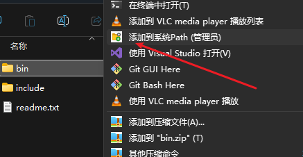

# PathVariableGenerator

A small and practical Windows utility that allows users to quickly add a folder's path to the system `Path` environment variable via the folder's right-click context menu. This tool is built with C# and .NET.

## ✨ Features

* One-click operation via the folder right-click menu.
* Directly adds to the **system** `Path` environment variable (effective for all users).
* Automatically checks if the path already exists to avoid duplicates.
* Requires administrator privileges to modify system environment variables; the program will automatically request elevation.
* Provides clear success or failure message prompts.
* Supports custom menu icons.

## 🚀 Prerequisites

### For Users:
* Windows Operating System (e.g., Windows 10, Windows 11).
* Administrator privileges (the program will automatically request this via UAC when run).

### For Developers (to compile from source):
* [.NET 9.0 SDK](https://dotnet.microsoft.com/download/dotnet/9.0) (or the .NET SDK version used in your project).
* Git (for cloning the repository).
* Visual Studio Code (recommended) or other editor/IDE supporting .NET projects.

## 🛠️ How to Compile

1.  Clone this repository to your local machine:
    ```bash
    git clone https://github.com/qq13456116532/PathVariableGenerator
    ```
  
2.  Navigate to the project directory:
    ```bash
    cd PathVariableGenerator
    ```
3.  Build the Release version using the .NET CLI:
    ```bash
    dotnet build -c Release
    ```
    After successful compilation, the executable `PathVariableGenerator.exe` will be generated in the project's `bin/Release/net9.0-windows/` directory.

## ⚙️ Installation and Usage

1.  **Obtain the program:**
    Compile `PathVariableGenerator.exe` yourself by following the "How to Compile" steps above.

2.  **Place the program:**
    Copy the obtained `PathVariableGenerator.exe` file to a **stable and permanent** location. For example:
    * `C:\Program Files\PathVariableGenerator\`
    * `C:\Utils\PathVariableGenerator\`
    **(Important: Do not use the files directly from the `bin\Release` or `bin\Debug` directories as your final deployment path, as these paths may change or be deleted when you clean or recompile the project.)**

3.  **Configure the registry file:**
    This repository provides two `.reg` registry files:
    * `installRegister.reg` (to add the context menu)
    * `uninstallRegister.reg` (to remove the context menu)

    * Open `installRegister.reg` with a text editor (like Notepad, VS Code).
    * Find the following two lines (or similar):
        ```reg
        "Icon"="C:\\Program Files\\PathVariableGenerator\\PathVariableGenerator.exe,0"
        @="\"C:\\Program Files\\PathVariableGenerator\\PathVariableGenerator.exe\" \"%1\""
        ```
    * **Change the path `E:\\VSproject\\test_grpc\\PathVariableGenerator\\bin\\Debug\\net9.0-windows\\PathVariableGenerator.exe` to the actual path where you placed `PathVariableGenerator.exe` in Step 2.** Note: Single backslashes `\` in the path need to be written as double backslashes `\\` in `.reg` files.
    * **When saving the file, ensure the file encoding is `UTF-16 LE` (Unicode Little Endian)** to ensure that Chinese characters in the menu item are displayed correctly. In Notepad, select "Save As", and then choose "Unicode" in the encoding options.

4.  **Import the registry:**
    Double-click the edited and saved `installRegister.reg` file. The system will ask if you want to add the information to the registry; select "Yes".

5.  **Usage:**
    Now, when you right-click on any folder, you should see an option named "添加到系统Path (管理员)" (Add to System Path (Administrator)), possibly with an icon. Clicking this option will prompt for administrator privileges (UAC dialog). After granting permission, the folder's path will be added to the system Path.

## 🗑️ Uninstallation

1.  **Remove the context menu:**
    * If you previously modified and used `installRegister.reg`, the key paths in `uninstallRegister.reg` should match. You can directly double-click `uninstallRegister.reg` to remove the registry entries.
    * If you are concerned, you can first open the uninstallation `.reg` file with a text editor to confirm that the key paths to be deleted are consistent with those added during installation.
2.  **Delete the program file:**
    Manually delete the `PathVariableGenerator.exe` file that you placed in Step 2 of the installation.

## 📄 Project File Structure (Overview)

* `/.gitignore`: Specifies files and folders for Git to ignore.
* `/PathVariableGenerator/` (or `/src/`): Contains the core C# project files.
    * `PathVariableGenerator.csproj`: Project file.
    * `Program.cs`: Main C# source code.
    * `app.manifest`: Application manifest file (used for requesting administrator privileges, etc.).
    * `app_icon.ico`: Application icon file.
* `*.reg*`: Contains registry file templates.
    * `installRegister.reg`: Template for adding the context menu.
    * `uninstallRegister.reg`: Template for removing the context menu.
* `README.md`: This readme file.
* `README-en.md`: English version of this readme file.


## 📜 License
Nothing

## 🤔 (Optional) Troubleshooting

* **Garbled menu text**: Ensure your `.reg` file was saved with `UTF-16 LE` encoding.
* **Permission errors**: Ensure `PathVariableGenerator.exe` is correctly configured with `app.manifest` to request administrator privileges, and that you grant permission at the UAC prompt.
* **Icon not displaying**: Check that the `Icon` entry path in the `.reg` file correctly points to your `.exe` file (and the index is `,0`). Confirm that the `.exe` file has successfully embedded the icon. You may need to restart File Explorer or log out/log in to see the icon update.
* **Side-by-side configuration error**: If you encounter this error, ensure that the required .NET runtime and any relevant Visual C++ Redistributables are installed on the target system (although pure C# applications typically trigger this less directly unless there are specific native dependencies).

---

**Example content of `installRegister.reg`:**
```reg
Windows Registry Editor Version 5.00

[HKEY_CLASSES_ROOT\Directory\shell\AddSelectedFolderToSystemPath]
@="添加到系统Path (管理员)"
"Icon"="C:\\Program Files\\PathVariableGenerator\\PathVariableGenerator.exe,0" ; <-- Modify this path!

[HKEY_CLASSES_ROOT\Directory\shell\AddSelectedFolderToSystemPath\command]
@="\"C:\\Program Files\\PathVariableGenerator\\PathVariableGenerator.exe\" \"%1\"" ; <-- Modify this path!
``` 