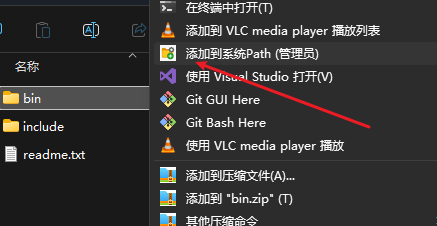

# PathVariableGenerator (环境变量自动生成器)

一款小巧实用的 Windows 工具，允许用户通过文件夹的右键快捷菜单，快速将该文件夹路径添加到系统的 `Path` 环境变量中。本工具使用 C# 和 .NET 构建。

## ✨ 功能特性

* 通过文件夹右键菜单一键操作。
* 直接添加到**系统** `Path` 环境变量 (对所有用户生效)。
* 自动检查路径是否已存在，避免重复添加。
* 需要管理员权限以修改系统环境变量，程序会自动请求提权。
* 提供清晰的成功或失败消息提示。
* 支持自定义菜单图标。

## 🚀 先决条件

### 对于使用者：
* Windows 操作系统 (例如 Windows 10, Windows 11)。
* 管理员权限（程序运行时会自动通过 UAC 请求）。

### 对于开发者 (从源码编译)：
* [.NET 9.0 SDK](https://dotnet.microsoft.com/download/dotnet/9.0) (或您项目中使用的 .NET SDK 版本)。
* Git (用于克隆仓库)。
* Visual Studio Code (推荐) 或其他支持 .NET 项目的编辑器/IDE。

## 🛠️ 如何编译 (供开发者)

1.  克隆本仓库到您的本地计算机：
    ```bash
    git clone [https://github.com/YOUR_USERNAME/PathVariableGenerator.git](https://github.com/YOUR_USERNAME/PathVariableGenerator.git)
    ```
    (请将 `YOUR_USERNAME` 替换为您的 GitHub 用户名)
2.  进入项目目录：
    ```bash
    cd PathVariableGenerator
    ```
3.  使用 .NET CLI 构建 Release 版本：
    ```bash
    dotnet build -c Release
    ```
    编译成功后, 可执行文件 `PathVariableGenerator.exe` 会生成在项目的 `bin/Release/net9.0-windows/` (具体路径取决于您的目标框架) 目录下。

## ⚙️ 安装与使用

1.  **获取程序：**
    * **选项 A (推荐)：** 前往本项目的 [GitHub Releases 页面](https://github.com/YOUR_USERNAME/PathVariableGenerator/releases) (您需要先创建 Release 并上传预编译文件) 下载最新的 `PathVariableGenerator.exe`。
    * **选项 B：** 按照上面的 "如何编译" 步骤自行编译得到 `PathVariableGenerator.exe`。

2.  **放置程序：**
    将获取到的 `PathVariableGenerator.exe` 文件复制到一个**稳定且永久**的存放位置。例如：
    * `C:\Program Files\PathVariableGenerator\`
    * `C:\Utils\PathVariableGenerator\`
    **(重要：不要直接使用 `bin\Release` 或 `bin\Debug` 目录下的文件作为最终部署路径，因为这些路径可能会在您清理或重新编译项目时改变或被删除。)**

3.  **配置注册表文件：**
    本仓库的 `reg_templates` 目录下提供了两个注册表模板文件：
    * `installRegister.reg` (用于添加右键菜单)
    * `uninstallRegister.reg` (用于移除右键菜单)

    * 使用文本编辑器 (如记事本、VS Code) 打开 `installRegister.reg`。
    * 找到以下两行（或类似行）：
        ```reg
        "Icon"="C:\\Program Files\\PathVariableGenerator\\PathVariableGenerator.exe,0"
        @="\"C:\\Program Files\\PathVariableGenerator\\PathVariableGenerator.exe\" \"%1\""
        ```
    * **将其中的路径 `E:\\VSproject\\test_grpc\\PathVariableGenerator\\bin\\Debug\\net9.0-windows\\PathVariableGenerator.exe` 修改为您在步骤 2 中实际存放 `PathVariableGenerator.exe` 的路径。** 注意：路径中的单个反斜杠 `\` 在 `.reg` 文件中需要写为双反斜杠 `\\`。
    * **保存文件时，请确保文件编码为 `UTF-16 LE` (Unicode Little Endian)**，以保证菜单项中的中文字符能正确显示。在记事本中，选择 "另存为"，然后在编码选项中选择 "Unicode"。

4.  **导入注册表：**
    双击编辑并保存好的 `installRegister.reg` 文件。系统会询问您是否确认要将信息添加到注册表，请选择 "是 (Yes)"。

5.  **使用：**
    现在，当您右键单击任意一个文件夹时，应该能看到一个名为 "添加到系统Path (管理员)" (或您在 `.reg` 文件中设置的文本) 的选项，并可能带有一个图标。点击该选项，程序会请求管理员权限 (UAC 弹窗)，授权后即可将该文件夹路径添加到系统 Path。

## 🗑️ 卸载

1.  **移除右键菜单：**
    * 如果您之前修改并使用了 `installRegister.reg`，那么 `uninstallRegister.reg` 中的键路径应该是匹配的。您可以直接双击 `uninstallRegister.reg` 来移除注册表项。
    * 如果担心，可以先用文本编辑器打开卸载用的 `.reg` 文件，确认其要删除的键路径与安装时添加的一致。
2.  **删除程序文件：**
    手动删除您在安装步骤 2 中放置的 `PathVariableGenerator.exe` 文件。

## 📄 项目文件结构 (概览)

* `/.gitignore`: 指定 Git 忽略的文件和文件夹。
* `/PathVariableGenerator/` (或 `/src/`): 包含 C# 项目的核心文件。
    * `PathVariableGenerator.csproj`: 项目文件。
    * `Program.cs`:主要的 C# 源代码。
    * `app.manifest`: 应用程序清单文件 (用于请求管理员权限等)。
    * `app_icon.ico` (或类似名称): 应用程序图标文件。
* `*.reg*`: 包含注册表文件模板。
    * `installRegister.reg`: 添加右键菜单的模板。
    * `uninstallRegister.reg`: 移除右键菜单的模板。
* `README.md`: 本说明文件。


## 📜 许可证 (License)
Nothing


## 🤔 (可选) 故障排除

* **菜单文本乱码**：确保您的 `.reg` 文件在保存时使用了 `UTF-16 LE` 编码。
* **权限错误**：确保 `PathVariableGenerator.exe` 正确配置了 `app.manifest` 以请求管理员权限，并且您在 UAC 提示时授予了权限。
* **图标不显示**：检查 `.reg` 文件中 `Icon` 条目的路径是否正确指向您的 `.exe` 文件（且索引为 `,0`），并确认 `.exe` 文件已成功嵌入图标。可能需要重启文件资源管理器或注销/登录才能看到图标更新。
* **并行配置错误**：如果遇到此错误，请确保已安装目标系统所需的 .NET 运行时和任何相关的 Visual C++ Redistributable (尽管纯 C# 应用通常较少直接触发此问题，除非有特定本地依赖)。

---

**注册表模板文件示例内容：**

**`reg_templates/installRegister.reg`:**
```reg
Windows Registry Editor Version 5.00

[HKEY_CLASSES_ROOT\Directory\shell\AddSelectedFolderToSystemPath]
@="添加到系统Path (管理员)"
"Icon"="C:\\Program Files\\PathVariableGenerator\\PathVariableGenerator.exe,0" ; <-- 修改此路径!

[HKEY_CLASSES_ROOT\Directory\shell\AddSelectedFolderToSystemPath\command]
@="\"C:\\Program Files\\PathVariableGenerator\\PathVariableGenerator.exe\" \"%1\"" ; <-- 修改此路径!